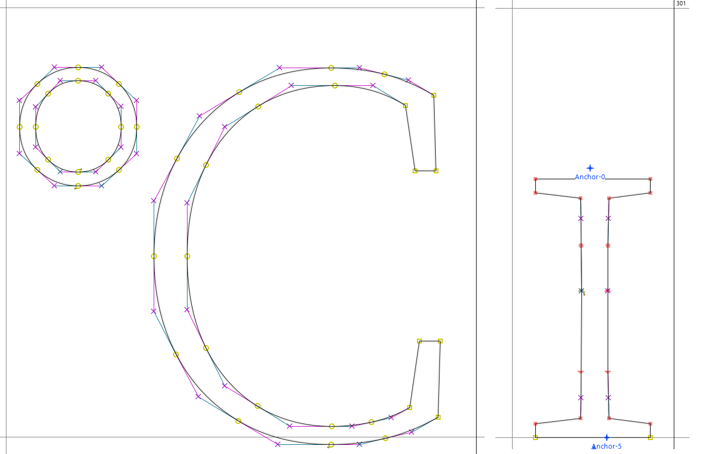

# RH-Source Serif Pro

RH-Source Serif Pro is a fork of Adobe's Source Serif Pro v3.1 (TrueType layout). It includes two additional glyphs: '℃' and 'ɪ'. It is currently used in some private projects.

The name 'RH' stands for 'Re-hinting', although no new hinting is actually applied to the font. 'RH' has another meaning.

**This font is only available in the Light weight.**

